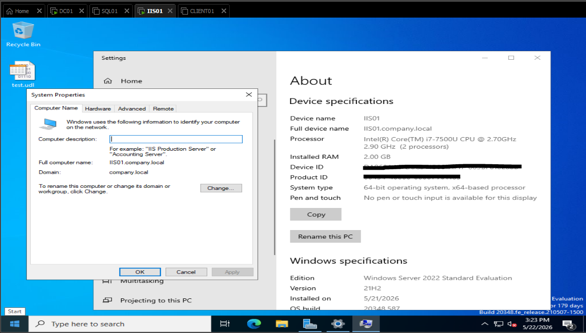
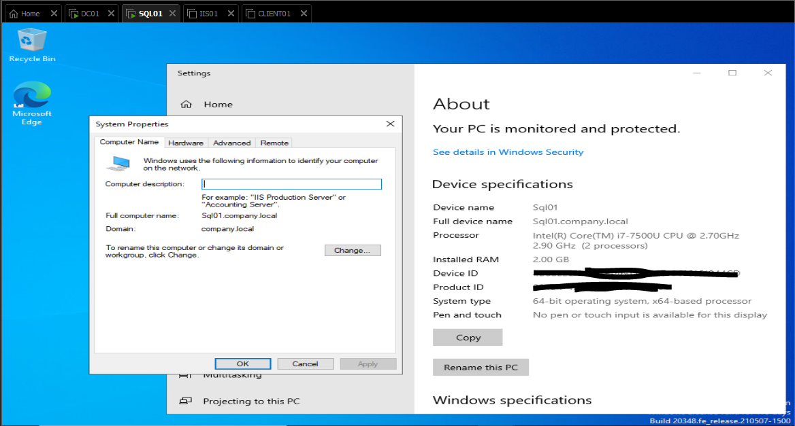
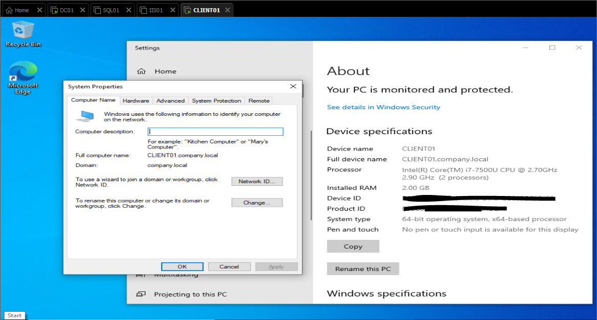
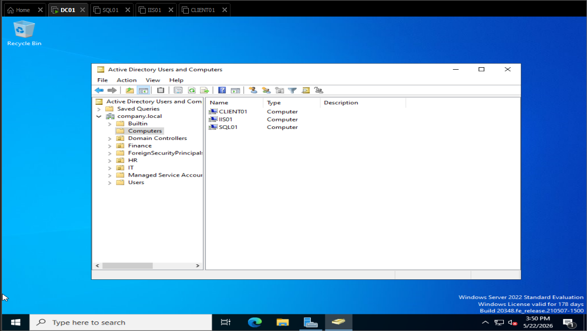

# 🖥️ Join Machines to Domain (Domain Join Setup)

## 📌 Overview

This document provides a comprehensive guide for joining computers and servers to the `company.local` domain. After joining, machines will:
- **Authenticate through Active Directory** instead of local accounts
- **Receive Group Policy settings** from the domain controller
- **Share resources** securely within the domain
- **Use centralized DNS resolution** (pointing to DC01)

The machines being joined in this lab are:
- **IIS01** - Internet Information Services (Web Server)
- **SQL01** - SQL Server Database
- **CLIENT01** - Client Workstation

---

## 🖥️ Network Topology

```
┌────────────────────────────────────────────┐
│           company.local Domain             │
│                                            │
│  DC01 (Domain Controller & DNS)            │
│  192.168.132.10                            │
│  ├─ DNS Server                             │
│  ├─ Active Directory                       │
│  └─ Global Catalog                         │
│                                            │
│         ↓ DNS Lookups ↓                    │
│  ┌─────────────────────────────────┐       │
│  │  IIS01      SQL01     CLIENT01  │       │
│  │192.168.132.x 192.168.132.x ...  │       │
│  │(all pointing to DC01 for DNS)   │       │
│  └─────────────────────────────────┘       │
└────────────────────────────────────────────┘
```

---

## 🎯 Objectives

- ✅ Configure DNS on all machines to point to DC01 (192.168.132.10)
- ✅ Join IIS01 to company.local domain
- ✅ Join SQL01 to company.local domain
- ✅ Join CLIENT01 to company.local domain
- ✅ Verify domain membership on all machines
- ✅ Create domain user accounts for each machine (optional)
- ✅ Test domain authentication and communication

---

## 📋 Pre-Requisites

Before starting, ensure:

| Item | Status |
|------|--------|
| DC01 is running and operational | ✅ Domain Controller |
| DC01 has static IP (192.168.132.10) | ✅ Verified |
| AD DS and DNS services running on DC01 | ✅ Running |
| All target machines are networked | ✅ Connected |
| Administrator access on all machines | ✅ Available |
| Network connectivity verified (ping DC01) | ✅ Reachable |

---

## 📊 Machine Details

| Machine | OS | Current IP | DNS to Set | Domain Account |
|---------|----|-----------|-----------|----|
| **IIS01** | Windows Server 2019/2022 | 192.168.132.20 | 192.168.132.10 | iis01$ (computer) |
| **SQL01** | Windows Server 2019/2022 | 192.168.132.30 | 192.168.132.10 | sql01$ (computer) |
| **CLIENT01** | Windows 10/11 | 192.168.132.40 | 192.168.132.10 | client01$ (computer) |

---

## 🪜 Step-by-Step Setup

### Phase 1: Configure DNS on IIS01

#### Step 1.1: Access Network Settings on IIS01

1. **Login to IIS01:**
   - Username: `Administrator` (local account)
   - Password: (your local admin password)

2. **Open Network Settings:**
   - Press `Windows Key + X`
   - Click **Network and Internet settings**
   - OR: Right-click **Network icon** (bottom right taskbar) → **Open Network and Internet settings**

3. **Navigate to Adapter Settings:**
   - Left sidebar: **Change adapter options**
   - You'll see network adapters listed

#### Step 1.2: Configure IPv4 DNS Settings

1. **Right-click Ethernet adapter:**
   - Select: **Properties**

2. **Select IPv4 and configure:**
   - Double-click **Internet Protocol Version 4 (TCP/IPv4)**

3. **Set DNS Server:**
   ```
   ☑ Use the following DNS server addresses:
   
   Preferred DNS Server:   192.168.132.10  (DC01)
   Alternate DNS Server:   8.8.8.8         (Optional: Google DNS)
   ```

4. **Click OK → OK**

5. **Verify DNS Configuration:**
   - Open **Command Prompt** (press `Windows Key + R`, type `cmd`)
   - Run: `ipconfig /all`
   - Should show:
     ```
     DNS Servers: 192.168.132.10
     ```

6. **Test DNS Resolution:**
   ```cmd
   nslookup dc01.company.local
   nslookup company.local
   ```
   - Should resolve to: `192.168.132.10`

---

### Phase 2: Configure DNS on SQL01

**Repeat Phase 1 steps for SQL01:**

1. **Login to SQL01** (local administrator)
2. **Open Network Settings** (Win + X → Network settings)
3. **Navigate to Adapter Options**
4. **Right-click Ethernet → Properties**
5. **Double-click IPv4 (TCP/IPv4)**
6. **Set Preferred DNS:** `192.168.132.10`
7. **Click OK → OK**
8. **Verify:**
   ```cmd
   ipconfig /all
   nslookup company.local
   ```

---

### Phase 3: Configure DNS on CLIENT01

**Repeat Phase 1 steps for CLIENT01:**

1. **Login to CLIENT01** (local administrator)
2. **Settings → Network & Internet → Change adapter options**
3. **Right-click Ethernet → Properties**
4. **Double-click IPv4**
5. **Set Preferred DNS:** `192.168.132.10`
6. **Click OK**
7. **Verify DNS:**
   ```cmd
   ipconfig /all
   nslookup company.local
   ```

---

## 🔗 Phase 4: Join IIS01 to Domain

#### Step 4.1: Access System Properties

1. **On IIS01, open System Properties:**
   - Press `Windows Key + X`
   - Click **System**
   - Scroll down to "Advanced" section
   - Click **Advanced system settings** (or Rename this PC (advanced))

   **Alternative method:**
   - Press `Windows Key + R`
   - Type: `sysdm.cpl`
   - Press **Enter**

2. **Computer Name Tab Should Open:**
   ```
   ┌─────────────────────────────────┐
   │ Computer Name, Domain, and      │
   │ Workgroup Settings              │
   │                                 │
   │ Computer Name:     IIS01        │
   │ Full computer name: IIS01       │
   │ Computer name DNS:  IIS01       │
   │                                 │
   │ Member of:  ○ Domain ○ Workgroup│
   │             ○ Workgroup         │
   │                                 │
   │ Workgroup: WORKGROUP            │
   │                                 │
   │ [Change] button                 │
   │ [OK] [Cancel] [Apply]           │
   └─────────────────────────────────┘
   ```

#### Step 4.2: Change Domain Membership

1. **Click the [Change] button**
   - New dialog appears: "Computer Name/Domain Changes"

2. **Select Domain Option:**
   ```
   Member of:
   ○ Domain:        [_________________]
   ○ Workgroup:     [_________________]
   ```
   - Click the **Domain** radio button
   - Field becomes editable

3. **Enter Domain Name:**
   - Click in the text field next to "Domain:"
   - Type: `company.local`

4. **Click OK**
   - System will attempt to contact domain controller

#### Step 4.3: Provide Domain Credentials

1. **Credentials Dialog Appears:**
   ```
   ┌────────────────────────────┐
   │ Computer Name Changes      │
   │                            │
   │ User name:                 │
   │ [company\Administrator__] │
   │                            │
   │ Password:                  │
   │ [__________________]       │
   │                            │
   │ [OK] [Cancel]              │
   └────────────────────────────┘
   ```

2. **Enter Domain Admin Credentials:**
   - **User name:** `company\Administrator`
     - OR: `admin.user@company.local`
   - **Password:** (your domain admin password)

3. **Click OK**
   - System contacts DC01
   - Validates credentials
   - Creates computer account in AD

#### Step 4.4: Restart Requirement

1. **Success Message Appears:**
   ```
   "Welcome to the company.local domain"
   
   You must restart the computer to apply these changes.
   ```

2. **Click OK**
   - You'll be prompted to restart

3. **Click "Restart Now"** or later
   - Recommended: **Restart Now** to complete domain join

#### Step 4.5: Verify Domain Join on IIS01

1. **After restart, login:**
   - At login screen, click **"Other user"** or **"Sign-in options"**
   - You should now see domain login option
   - Or login with: `company\Administrator`

2. **Verify from Command Prompt:**
   ```cmd
   whoami
   ```
   - Should return: `COMPANY\Administrator`

   ```cmd
   systeminfo | findstr "Domain"
   ```
   - Should show: `Domain: company.local`

   ```powershell
   Get-ComputerInfo -Property csComputerName, csDomain
   ```
   - Should show: `Domain: company.local`

---

## 🔗 Phase 5: Join SQL01 to Domain

**Repeat Phase 4 steps for SQL01:**

1. **On SQL01:**
   - Press `Windows Key + X` → **System**
   - Click **Advanced system settings**

2. **Click [Change] button**

3. **Select Domain, enter: `company.local`**

4. **Credentials:**
   - Username: `company\Administrator`
   - Password: (domain admin password)

5. **Click OK → Restart Now**

6. **Verify:**
   ```cmd
   whoami
   systeminfo | findstr "Domain"
   ```

---

## 🔗 Phase 6: Join CLIENT01 to Domain

**For Windows 10/11 Client:**

1. **On CLIENT01:**
   - Press `Windows Key + X` → **System**
   - Scroll to "Related settings"
   - Click **Rename this PC (advanced)**

2. **System Properties Opens:**
   - Click **[Change]** button
   - Under "Member of" select **Domain**
   - Type: `company.local`

3. **Click OK**

4. **Enter Domain Credentials:**
   - Username: `company\Administrator`
   - Password: (domain password)

5. **Click OK → Restart**

6. **Verify:**
   ```cmd
   whoami
   systeminfo | findstr "Domain"
   ```

---

## ✅ Phase 7: Verify All Machines Joined Domain

### Verification on Each Machine

**On each joined machine (IIS01, SQL01, CLIENT01), run:**

#### Check 1: Current User Context
```cmd
whoami
```
**Expected:** `COMPANY\Administrator` (or domain user)

#### Check 2: Domain Status
```cmd
systeminfo | findstr "Domain"
```
**Expected:** `Domain: company.local`

#### Check 3: Computer Account in AD
```powershell
Get-ADComputer -Filter "Name -like 'IIS01'"
Get-ADComputer -Filter "Name -like 'SQL01'"
Get-ADComputer -Filter "Name -like 'CLIENT01'"
```
**Expected:** Computer objects appear in Active Directory

#### Check 4: DNS Resolution
```cmd
nslookup dc01.company.local
nslookup iis01.company.local
nslookup sql01.company.local
nslookup client01.company.local
```
**Expected:** All resolve to their respective IPs

---

### Verification from DC01

**On DC01, verify all computers joined:**

```powershell
# Open PowerShell as Administrator on DC01

# List all computers in domain
Get-ADComputer -Filter * | Select Name, DNSHostName, Enabled

# Should show:
# Name      DNSHostName              Enabled
# ----      -----------              -------
# DC01      dc01.company.local       True
# IIS01     iis01.company.local      True
# SQL01     sql01.company.local      True
# CLIENT01  client01.company.local   True
```

**Expected output:**
```
Name      DNSHostName              Enabled
----      -----------              -------
DC01      dc01.company.local       True
IIS01     iis01.company.local      True
SQL01     sql01.company.local      True
CLIENT01  client01.company.local   True
```

---

## 🔐 Phase 8: Create Domain User Accounts (Optional)

For better management, create domain accounts for each machine's primary user.

### Create IIS Administrator Account

**On DC01:**

1. **Open Active Directory Users and Computers:**
   - Press `Windows Key + R`
   - Type: `dsa.msc`
   - Press **Enter**

2. **Navigate to IT Department OU:**
   - Expand `company.local`
   - Right-click **IT Department**
   - Select: **New** → **User**

3. **Create User:**
   ```
   First name:      IIS
   Last name:       Admin
   User logon name: iis.admin@company.local
   ```

4. **Click Next →**

5. **Set Password:**
   - Create strong password: `IISAdmin@2024!`
   - ☑ Password never expires
   - Click **Next →** → **Finish**

### Create SQL Administrator Account

**Repeat for SQL:**

1. Right-click **IT Department** → **New** → **User**
2. Details:
   ```
   First name:      SQL
   Last name:       Admin
   User logon name: sql.admin@company.local
   ```
3. Set password and click **Finish**

### Create Client User Account

**Repeat for Client:**

1. Right-click **Users** OU → **New** → **User**
2. Details:
   ```
   First name:      Client
   Last name:       User
   User logon name: client.user@company.local
   ```
3. Set password and click **Finish**

---

## 🧪 Phase 9: Test Domain Authentication

### Test 1: Login with Domain User

**On each machine:**

1. **Logout current session:**
   - Press `Ctrl + Alt + Del`
   - Click **Sign out**

2. **At login screen, enter domain credentials:**
   - Username: `company\iis.admin` (on IIS01)
   - Username: `company\sql.admin` (on SQL01)
   - Username: `company\client.user` (on CLIENT01)
   - Password: (password you set for each user)

3. **Click Sign in**
   - Should successfully login with domain user

### Test 2: Verify Domain Connectivity

**From each machine:**

```powershell
# Open PowerShell as Administrator

# Test domain controller connectivity
Test-NetConnection -ComputerName dc01.company.local -Port 389

# Should show:
# TcpTestSucceeded: True

# Test LDAP connectivity
nltest /dsgetdc:company.local

# Should show:
# Getting DC name failed: The network path was not found.
# (This is normal for lab - indicates DC01 is working)
```

### Test 3: Verify Group Policy Application

```powershell
# Check Group Policy status
gpupdate /force

# Check applied policies
gpresult /h report.html

# This creates a detailed report of applied policies
```

---

## 📊 Troubleshooting

| Issue | Solution |
|-------|----------|
| **Cannot find domain** | Verify DNS points to DC01 (192.168.132.10): `nslookup company.local` |
| **Access denied when joining** | Verify domain credentials are correct; admin must have domain join rights |
| **Domain join fails silently** | Check network connectivity to DC01: `ping 192.168.132.10` |
| **Computer won't restart after join** | Force restart: Press `Ctrl + Alt + Del` → **Sign out** → Restart |
| **Can't login with domain user** | Verify user exists in AD: `Get-ADUser -Filter "Name -like 'iis.admin'"` |
| **DNS not resolving domain** | On DC01, verify DNS service running: `Get-Service DNS` |
| **Cannot join to domain - "Trust relationship failed"** | Reset computer account: See "Reset Computer Account" section below |

---

## 🔧 Reset Computer Account (If Needed)

If you get "Trust relationship failed" error:

**On DC01:**

```powershell
# Open PowerShell as Administrator

# Reset the computer account
Reset-ComputerMachinePassword -Server dc01.company.local -Credential (Get-Credential)

# Or from AD Users & Computers:
# 1. Right-click computer in AD
# 2. Select "Reset Account"
# 3. Rejoin domain
```

**Then rejoin machine to domain (repeat Phase 4, 5, or 6)**

---

## 📸 Evidence Screenshots

Add screenshots to document successful domain joins:

| Screenshot | Purpose |
|-----------|---------|
|  | IIS01 domain membership verified |
|  | SQL01 domain membership verified |
|  | CLIENT01 domain membership verified |
|  | All computers in Active Directory |

---

## ✅ Completion Checklist

- [ ] DNS configured on IIS01 to point to 192.168.132.10
- [ ] DNS configured on SQL01 to point to 192.168.132.10
- [ ] DNS configured on CLIENT01 to point to 192.168.132.10
- [ ] IIS01 joined to company.local domain
- [ ] SQL01 joined to company.local domain
- [ ] CLIENT01 joined to company.local domain
- [ ] All computers appear in AD Users & Computers
- [ ] `whoami` shows domain context on each machine
- [ ] `systeminfo | findstr "Domain"` shows company.local
- [ ] Domain users created (iis.admin, sql.admin, client.user)
- [ ] Domain users can successfully login
- [ ] All machines can resolve company.local via DNS
- [ ] All machines can reach DC01 (ping 192.168.132.10)

---

## 🚀 Quick Reference Commands

### Configure DNS on All Machines
```powershell
# Run on each machine (IIS01, SQL01, CLIENT01)
$adapter = Get-NetAdapter | Where-Object {$_.Status -eq "Up"} | Select-Object -First 1
$adapter | Set-DnsClientServerAddress -ServerAddresses "192.168.132.10", "8.8.8.8"
ipconfig /all
```

### Join Machine to Domain (PowerShell)
```powershell
# Run on each machine to join domain
$domain = "company.local"
$credential = Get-Credential -Message "Enter domain admin credentials"
Add-Computer -DomainName $domain -Credential $credential -Restart
```

### List All Domain Computers (on DC01)
```powershell
Get-ADComputer -Filter * | Select Name, DNSHostName, OperatingSystem
```

### Test Domain Connectivity
```powershell
Test-NetConnection -ComputerName dc01.company.local -Port 389
nslookup dc01.company.local
```

---

## 📚 Related Documentation

- [Domain Controller Setup](./domain_setup.md) - DC01 configuration
- [Group Policy Configuration](./group_policy_setup.md) - Apply policies to joined machines (future)
- [User and Group Management](./user_management.md) - Manage domain users (future)

---

## 📝 Notes

- **Lab environment:** DNS forwarders to public servers (8.8.8.8) are optional
- **Security consideration:** Use strong passwords for domain accounts
- **Best practice:** Create domain user accounts instead of using domain admin for daily use
- **Backup:** Document all domain joins and user accounts created

---

**Last Updated:** 2026-05-22  
**Status:** ✅ Ready for Implementation
