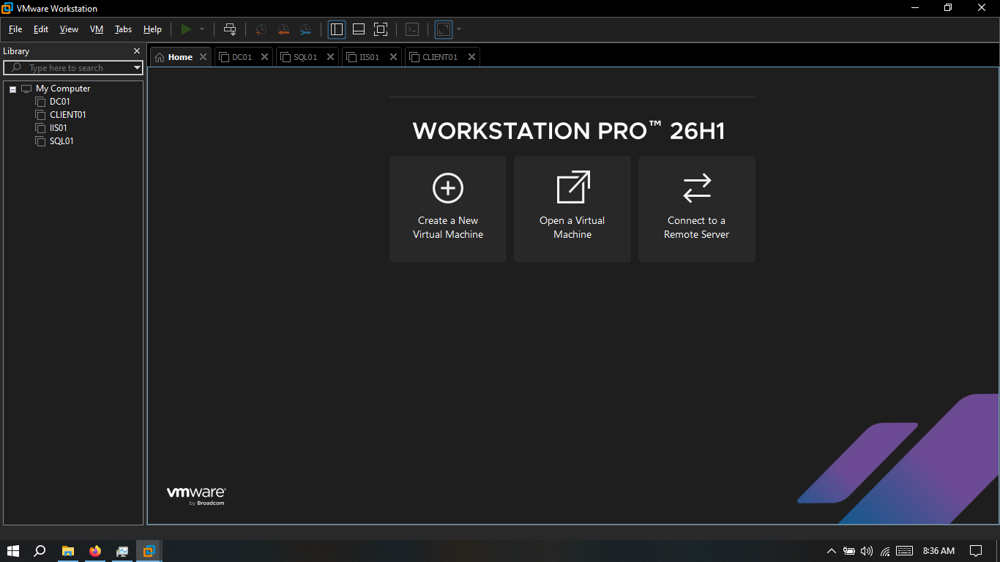
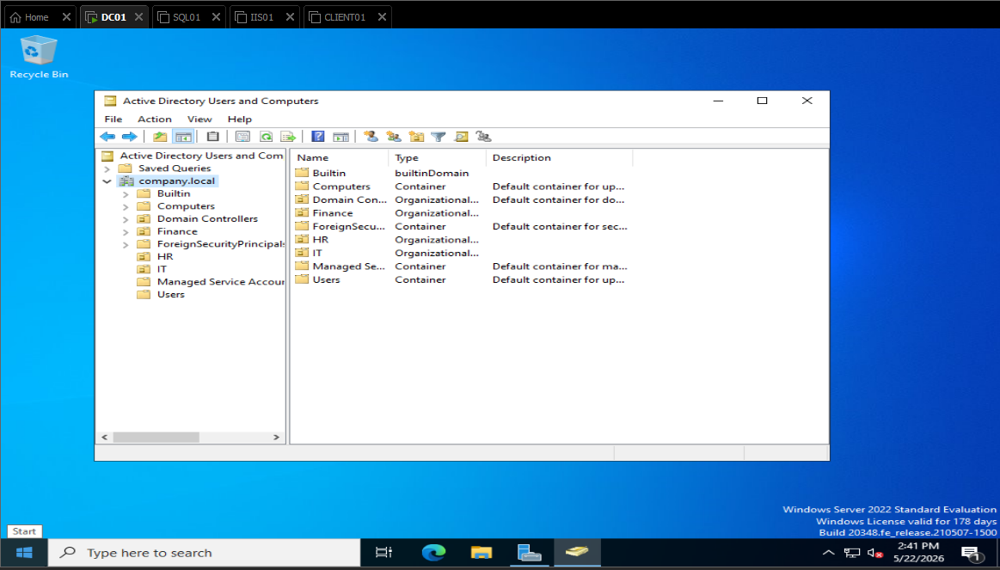
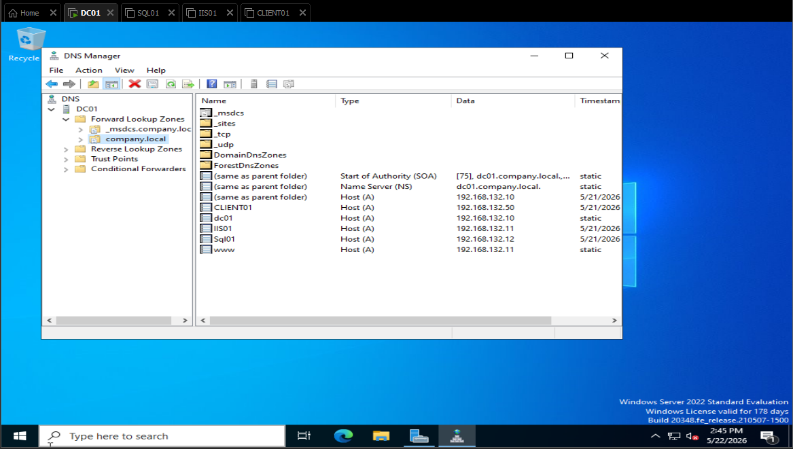
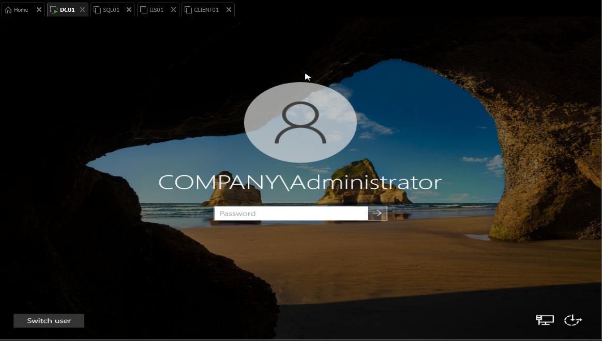

# 🏢 Domain Controller Setup (Active Directory)

## 📌 Overview

This document provides a comprehensive guide for setting up a Domain Controller using Windows Server. This establishes a centralized authentication and identity management system using Active Directory Domain Services (AD DS).

The domain (`company.local`) created in this lab environment enables:
- **Centralized user and computer management**
- **Unified authentication across the network**
- **Group Policy enforcement**
- **Secure resource access control**

---

## 🖥️ Server Specifications

| Property | Value |
|----------|-------|
| **Server Name** | `DC01` |
| **Operating System** | Windows Server 2019/2022 |
| **Primary Role** | Domain Controller |
| **Secondary Role** | DNS Server |
| **Domain Name** | `company.local` |
| **IP Address** | `192.168.132.10` |
| **Subnet Mask** | `255.255.255.0` |
| **Default Gateway** | `192.168.132.2` |

---

## 🎯 Objectives

- ✅ Install Active Directory Domain Services (AD DS)
- ✅ Promote server to Domain Controller status
- ✅ Create a new Active Directory forest and domain
- ✅ Configure DNS services automatically
- ✅ Establish organizational structure (OUs and Groups)
- ✅ Create domain user accounts with proper access controls

---

## 🪜 Step-by-Step Setup Guide

### 1️⃣ Configure Static IP Address

A static IP is **critical** for DC stability and DNS resolution.

**Steps:**

1. Open **Settings** → **Network & Internet** → **Change adapter options**
2. Right-click the network adapter → **Properties**
3. Select **Internet Protocol Version 4 (TCP/IPv4)** → **Properties**
4. Configure the following:
   - **IP Address:** `192.168.132.10`
   - **Subnet Mask:** `255.255.255.0`
   - **Default Gateway:** `192.168.132.2`
   - **Preferred DNS Server:** `127.0.0.1` (loopback - DC will serve DNS)
   - **Alternate DNS Server:** `8.8.8.8` (optional, for external resolution)
5. Click **OK** and verify connectivity with `ping 192.168.132.2`

**Verification:**
```powershell
# Open PowerShell as Administrator to verify
ipconfig /all
```

---

### 2️⃣ Rename Server (Optional but Recommended)

Before promoting to DC, set the server name to match your naming convention.

**Steps:**

1. Press **Win + X** → **System**
2. Click **Rename this PC**
3. Enter name: `DC01`
4. Click **Next** → **Restart**

---

### 3️⃣ Install Active Directory Domain Services Role

**Steps:**

1. Open **Server Manager** (or press Win + R, type `servermanager`)
2. Click **Add Roles and Features** in the Dashboard
3. **Before You Begin** → Click **Next**
4. **Installation Type:**
   - Select **Role-based or feature-based installation** → **Next**
5. **Server Selection:**
   - Select your server (DC01) → **Next**
6. **Server Roles:**
   - ☑️ Check **Active Directory Domain Services**
   - A popup will appear → Click **Add Features** (auto-includes DNS Server)
   - Click **Next**
7. **Features:**
   - Recommended defaults are fine → Click **Next**
8. **AD DS:**
   - Review information → Click **Next**
9. **Confirmation:**
   - ☑️ Check **Restart the destination server automatically if required**
   - Click **Install**
10. Wait for installation to complete (~2-5 minutes)

---

### 4️⃣ Promote Server to Domain Controller

After installation completes, the promotion wizard will appear automatically.

**Steps:**

1. In **Server Manager**, click the **⚠️ notification flag** at the top
2. Click **Promote this server to a domain controller**
3. **Deployment Configuration:**
   - Select **Add a new forest**
   - **Root domain name:** Enter `company.local`
   - Click **Next**

4. **Domain Controller Options:**
   - **Forest Functional Level:** Windows Server 2016 or higher (match your OS)
   - **Domain Functional Level:** Windows Server 2016 or higher
   - ☑️ **DNS Server** (should be auto-selected)
   - ☑️ **Global Catalog** (should be auto-selected)
   - **Directory Services Restore Mode (DSRM) password:** Create a strong password (e.g., `P@ssw0rd123!`)
     - ⚠️ **Store this password securely** - you'll need it for recovery
   - Click **Next**

5. **DNS Options:**
   - Review settings → Click **Next**

6. **Additional Options:**
   - **NetBIOS domain name:** `COMPANY` (auto-populated)
   - Click **Next**

7. **Paths:**
   - Default locations are fine:
     - **Database:** `C:\Windows\NTDS`
     - **Log files:** `C:\Windows\NTDS`
     - **SYSVOL:** `C:\Windows\SYSVOL`
   - Click **Next**

8. **Review Options:**
   - Verify all settings → Click **Next**

9. **Prerequisites Check:**
   - All checks should pass (warnings are normal)
   - Click **Install**

10. Server will **restart automatically** and complete promotion (may take 5-10 minutes)

---

### 5️⃣ Verify Domain Controller Setup

After reboot, verify the DC is functioning properly.

**Login:**
- Username: `company\Administrator`
- Password: (password you set during Windows Server setup)

**Verification Steps:**

1. **Check Active Directory is running:**
   ```powershell
   # Open PowerShell as Administrator
   Get-ADDomain
   ```
   Expected output shows domain info for `company.local`

2. **Verify DNS is functioning:**
   ```powershell
   nslookup dc01.company.local
   nslookup company.local
   ```

3. **Open Active Directory Users and Computers:**
   - Press **Win + R** → Type `dsa.msc` → **OK**
   - Verify you see: `company.local` with default OUs

4. **Open DNS Manager:**
   - Press **Win + R** → Type `dnsmgmt.msc` → **OK**
   - Verify: Forward lookup zones show `company.local`

5. **Check Domain Controller health:**
   ```powershell
   dcdiag /v
   Test-ADServiceAccount
   ```

---

### 6️⃣ Create Organizational Units (OUs)

OUs organize users, computers, and apply Group Policies efficiently.

**Steps:**

1. Open **Active Directory Users and Computers** (`dsa.msc`)
2. Right-click on `company.local` → **New** → **Organizational Unit**
3. Create the following OUs:

   | OU Name | Purpose |
   |---------|---------|
   | **IT Department** | IT staff and admin accounts |
   | **HR Department** | HR staff accounts |
   | **Users** | General employee accounts |
   | **Computers** | Managed workstations |
   | **Service Accounts** | Application and service accounts |

**Example OU hierarchy:**
```
company.local
├── IT Department
├── HR Department
├── Users
├── Computers
└── Service Accounts
```

---

### 7️⃣ Create Domain User Accounts

**Steps:**

1. Open **Active Directory Users and Computers** (`dsa.msc`)
2. Navigate to the desired OU (e.g., **IT Department**)
3. Right-click → **New** → **User**
4. Fill in user details:

**Example User 1 - Admin Account:**
- **First name:** Admin
- **Last name:** User
- **User logon name:** `admin.user@company.local`
- Click **Next**
- **Password:** (set a strong password)
- ☑️ **User must change password at next logon** (optional, for security)
- Click **Next** → **Finish**

**Example User 2 - IT Support:**
- **First name:** IT
- **Last name:** Support
- **User logon name:** `it.support@company.local`
- Click **Next**
- **Password:** (set a strong password)
- Click **Next** → **Finish**

**Example User 3 - Test Account:**
- **First name:** Test
- **Last name:** User
- **User logon name:** `test.user@company.local`
- Click **Next**
- **Password:** (set a strong password)
- Click **Next** → **Finish**

**Post-Creation:**

1. Add users to security groups:
   - Right-click user → **Add to a group**
   - For `admin.user`: Add to **Domain Admins**
   - For `it.support`: Add to **IT Department** group (create if needed)

2. Verify user creation:
   ```powershell
   Get-ADUser -Filter * | Select Name, UserPrincipalName
   ```

---

## 🔐 Security Best Practices

- **DSRM Password:** Store securely (encrypted password manager or secure location)
- **Admin Accounts:** Limit Domain Admin membership to necessary personnel
- **Password Policy:** Configure minimum length (12+ characters) and complexity
- **Backup:** Perform System State backup immediately after DC setup
- **Firewall:** Only allow AD-related traffic (LDAP, Kerberos, DNS)

---

## 📸 Evidence (Screenshots)

Add screenshots to document setup completion:

| Screenshot | Purpose |
|-----------|---------|
|  | Server Manager showing AD DS role installed |
|  | Active Directory Users and Computers with OUs |
|  | DNS Manager showing company.local zones |
|  | Successful domain login |

---

## 🐛 Troubleshooting

| Issue | Solution |
|-------|----------|
| **DNS not resolving** | Restart DNS Server service: `Restart-Service DNS` |
| **User cannot login to domain** | Check user exists in AD and password is correct |
| **DC not appearing in Domain Controller list** | Run `dcdiag` and check for errors |
| **Can't connect to domain after restart** | Verify static IP is still configured |

---

## 📚 Additional Resources

- [Microsoft AD DS Documentation](https://learn.microsoft.com/en-us/windows-server/identity/ad-ds/ad-ds-getting-started)
- [Group Policy Best Practices](https://learn.microsoft.com/en-us/windows-server/administration/windows-commands/gpupdate)
- [Active Directory Security Hardening](https://learn.microsoft.com/en-us/windows-server/identity/ad-ds/plan/security-best-practices/securing-active-directory)
