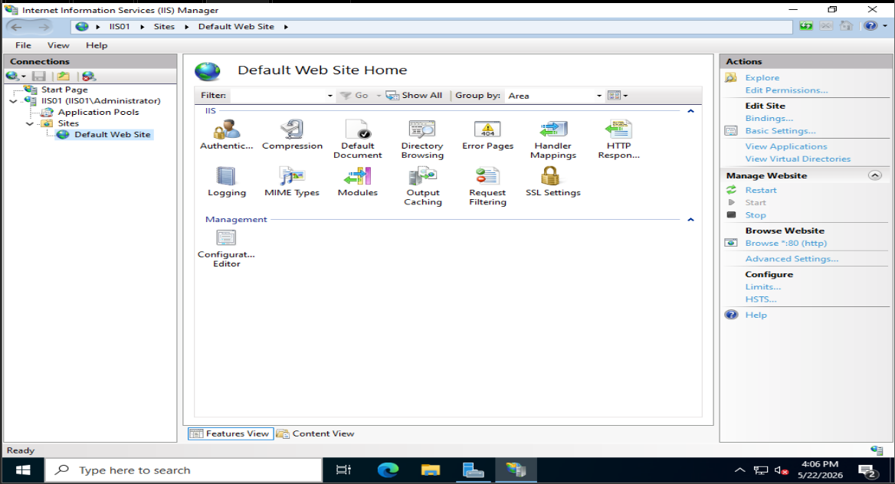
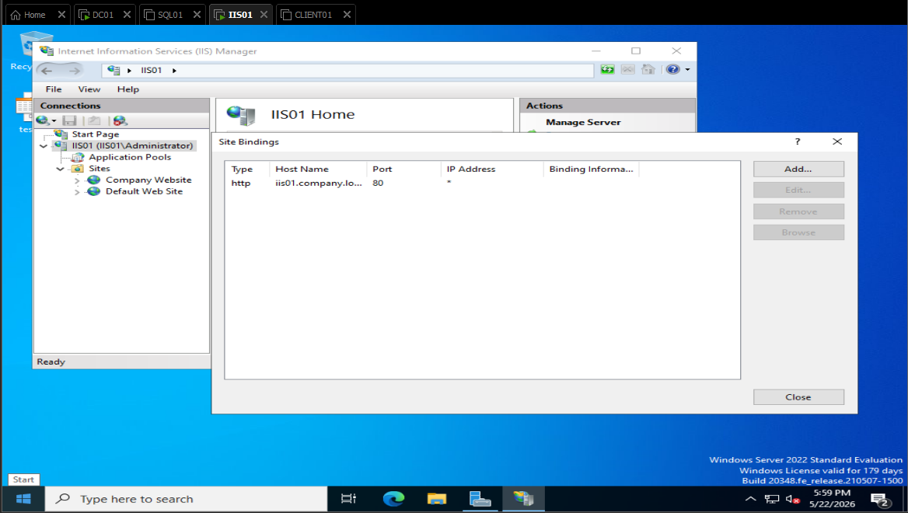
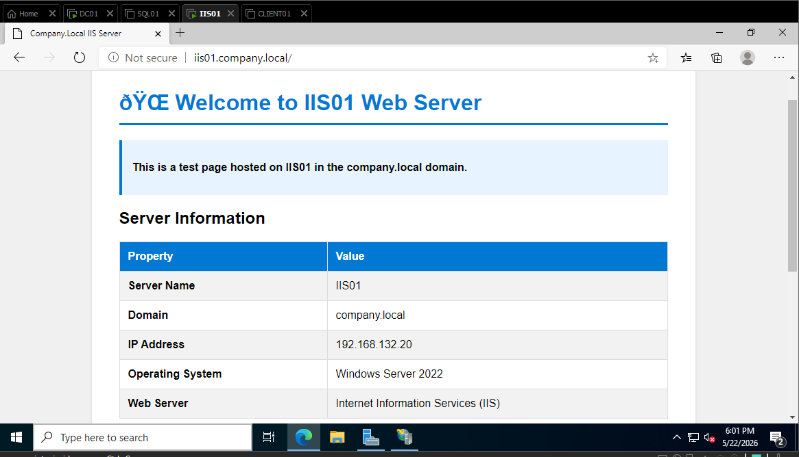
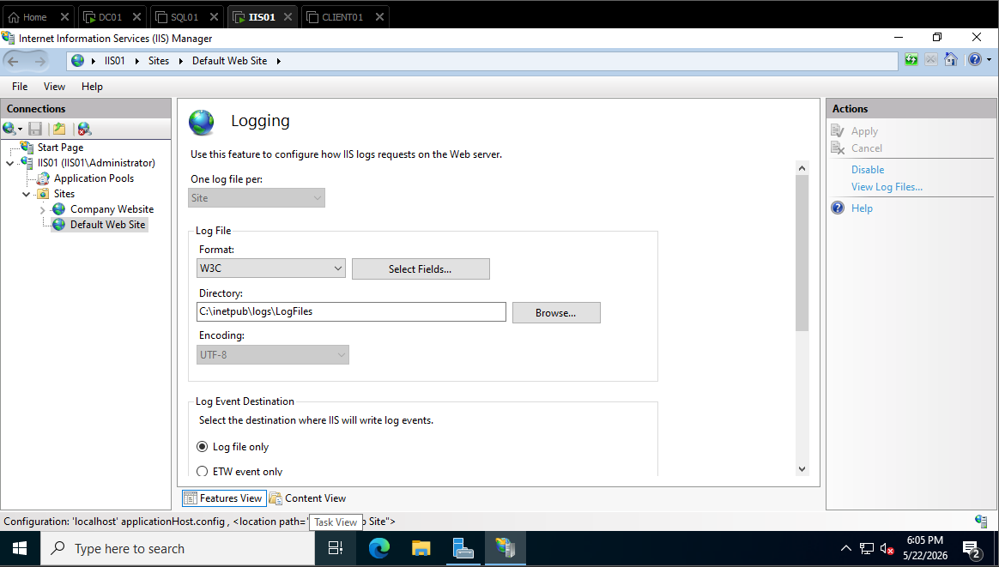
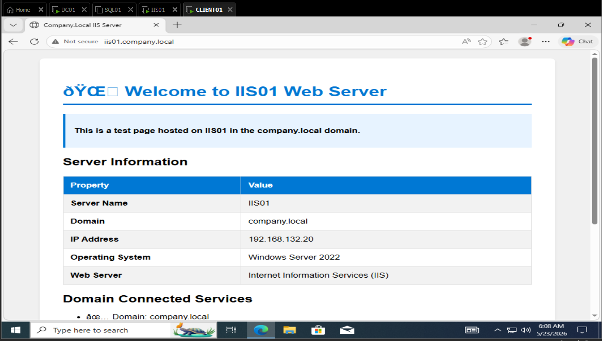

# 🌐 IIS Hosted Website - Build a Web Server

## 📌 Overview

This document provides a complete guide for setting up Internet Information Services (IIS) on the IIS01 server and hosting a website. IIS is Microsoft's web server platform that allows you to:

- **Host websites and web applications**
- **Serve HTTP/HTTPS traffic**
- **Manage multiple sites with different configurations**
- **Integrate with Active Directory** for authentication
- **Monitor and log web traffic**

By the end of this guide, you'll have a fully functional web server running on **IIS01** accessible from other domain computers.

---

## 🖥️ Server Details

| Property | Value |
|----------|-------|
| **Server Name** | `IIS01` |
| **Domain** | `company.local` |
| **IP Address** | `192.168.132.20` |
| **Operating System** | Windows Server 2019/2022 |
| **Service** | Internet Information Services (IIS) |
| **Default Website URL** | `http://iis01.company.local` |

---

## 🎯 Objectives

- ✅ Install Internet Information Services (IIS) role
- ✅ Install required IIS features and role services
- ✅ Configure a default website
- ✅ Create a custom website with sample content
- ✅ Configure application pool settings
- ✅ Set up proper NTFS permissions
- ✅ Enable domain user access to websites
- ✅ Test website accessibility from other machines
- ✅ Configure IIS logging for monitoring

---

## 📋 Pre-Requisites

Before starting, ensure:

| Item | Status | Details |
|------|--------|---------|
| IIS01 joined to company.local domain | ✅ Required | Machine must be domain-joined |
| Network connectivity to DC01 | ✅ Required | For DNS and authentication |
| Administrator access on IIS01 | ✅ Required | Local or domain admin account |
| At least 2GB free disk space | ✅ Required | For IIS and website files |
| .NET Framework 4.8+ | ✅ Recommended | For advanced web app support |
| Remote Desktop access | ✅ Recommended | For remote management |

---

## 🪜 Step-by-Step Setup

### Phase 1: Install IIS Role

#### Step 1.1: Access Server Manager on IIS01

1. **Login to IIS01:**
   - Username: `company\Administrator` (domain account)
   - Password: (your domain password)

2. **Open Server Manager:**
   - Press `Windows Key + R`
   - Type: `servermanager`
   - Press **Enter**

3. **Server Manager Dashboard Opens**

#### Step 1.2: Add IIS Role

1. **Click "Add Roles and Features"** button in Dashboard

2. **Before You Begin Screen:**
   - Read the information (optional)
   - Click **Next →**

3. **Installation Type:**
   - Select: **"Role-based or feature-based installation"**
   - Click **Next →**

4. **Server Selection:**
   - Your server (IIS01) should be highlighted
   - Click **Next →**

5. **Server Roles - SELECT WEB SERVER:**
   - Find and **☑️ CHECK**: **Web Server (IIS)**
   - A popup appears asking: "Add features required for Web Server (IIS)?"
   - Click **Add Features** (auto-selects required features)
   - Click **Next →**

6. **Features Screen:**
   - Default features are acceptable
   - Consider checking additional features:
     - ☑️ .NET Framework 4.8 (if not already installed)
     - ☑️ Windows Process Activation Service
   - Click **Next →**

7. **Web Server Role (IIS) Screen:**
   - Review the description
   - Click **Next →**

8. **Role Services - SELECT REQUIRED SERVICES:**
   - Keep **Web Server** and **Common HTTP Features** checked
   - Additionally select:
     - ☑️ **Default Document**
     - ☑️ **Directory Browsing**
     - ☑️ **HTTP Errors**
     - ☑️ **Static Content**
     - ☑️ **HTTP Logging**
     - ☑️ **Application Pool Recycling** (under App Dev Features)
   - Click **Next →**

9. **Confirmation Screen:**
   - ☑️ Check: **"Restart the destination server automatically if required"**
   - Click **Install**

10. **Installation Progress:**
    ```
    Installing...
    Progress: ████████░░ 80%
    
    Installation succeeded on IIS01
    ```
    - Takes 3-5 minutes
    - Server restarts automatically

#### Step 1.3: Verify IIS Installation

After restart, verify IIS is running:

1. **Open Internet Explorer or Edge browser:**
   - Press `Windows Key + R`
   - Type: `iexplore`
   - Press **Enter**

2. **Navigate to localhost:**
   - In address bar, type: `http://localhost`
   - Press **Enter**

3. **Expected Page:**
   ```
   Welcome to IIS
   ───────────────────────────────
   You have successfully installed
   Internet Information Services (IIS)
   on Windows Server.
   ```

4. **If you see this page, IIS is working!** ✅

---

### Phase 2: Configure Default Website

#### Step 2.1: Open IIS Manager

1. **On IIS01, open IIS Manager:**
   - Press `Windows Key + R`
   - Type: `inetmgr`
   - Press **Enter**

2. **IIS Manager Opens:**
   ```
   ┌─────────────────────────────────────┐
   │ Internet Information Services (IIS) │
   │ Manager                             │
   │                                     │
   │ Left Panel:                         │
   │ ├─ IIS01 (Server)                   │
   │ │  ├─ Sites                         │
   │ │  │  └─ Default Web Site           │
   │ │  ├─ Application Pools             │
   │ │  │  └─ DefaultAppPool             │
   │ │  └─ ... (other options)           │
   └─────────────────────────────────────┘
   ```

#### Step 2.2: Configure Default Website Bindings

1. **In left panel, expand "Sites"**
   - Right-click **Default Web Site**
   - Select **Edit Bindings...**

2. **Site Bindings Dialog:**
   ```
   Type:     http
   IP:       All Unassigned
   Port:     80
   Host:     (empty)
   ```

3. **Edit HTTP Binding:**
   - Click the `http` entry
   - Click **Edit**
   - Set Host name: `iis01.company.local`
   - Click **OK**

4. **Add HTTPS Binding (Optional):**
   - Click **Add**
   - Type: `https`
   - Port: `443`
   - Host: `iis01.company.local`
   - Click **OK**

5. **Close Site Bindings**
   - Click **Close**

#### Step 2.3: Configure Website Content Location

1. **In IIS Manager, right-click Default Web Site:**
   - Select **Edit Application...**
   - Or: **Basic Settings...**

2. **Basic Settings Dialog:**
   ```
   Physical path:     C:\inetpub\wwwroot
   Application pool:  DefaultAppPool
   ```

3. **Verify or change:**
   - **Physical path:** `C:\inetpub\wwwroot` (default location)
   - **Application pool:** `DefaultAppPool`
   - Click **OK**

#### Step 2.4: Test Default Website

1. **From IIS01, open browser:**
   - Type: `http://localhost`
   - You should see IIS welcome page

2. **From other domain machines (SQL01, CLIENT01):**
   - Open browser
   - Type: `http://iis01.company.local`
   - Should display IIS welcome page

3. **If both work, default website is configured correctly!** ✅

---

### Phase 3: Create Custom Website Content

#### Step 3.1: Create Website Files

1. **On IIS01, open File Explorer:**
   - Press `Windows Key + E`

2. **Navigate to website root:**
   - Path: `C:\inetpub\wwwroot`

3. **Create `index.html` file:**
   - Right-click in empty space
   - Select **New** → **Text Document**
   - Name it: `index.html`
   - Press **Enter**

4. **Edit index.html:**
   - Right-click `index.html`
   - Select **Open with** → **Notepad**

5. **Paste this HTML content:**
   ```html
   <!DOCTYPE html>
   <html>
   <head>
       <title>Company.Local IIS Server</title>
       <style>
           body {
               font-family: Arial, sans-serif;
               background-color: #f0f0f0;
               margin: 0;
               padding: 20px;
           }
           .container {
               max-width: 800px;
               margin: 0 auto;
               background-color: white;
               padding: 40px;
               border-radius: 8px;
               box-shadow: 0 2px 4px rgba(0,0,0,0.1);
           }
           h1 {
               color: #0078d4;
               border-bottom: 3px solid #0078d4;
               padding-bottom: 10px;
           }
           .info {
               background-color: #e7f3ff;
               padding: 15px;
               border-left: 4px solid #0078d4;
               margin: 20px 0;
           }
           table {
               width: 100%;
               border-collapse: collapse;
               margin-top: 20px;
           }
           table th, table td {
               border: 1px solid #ddd;
               padding: 12px;
               text-align: left;
           }
           table th {
               background-color: #0078d4;
               color: white;
           }
           table tr:nth-child(even) {
               background-color: #f2f2f2;
           }
       </style>
   </head>
   <body>
       <div class="container">
           <h1>🌐 Welcome to IIS01 Web Server</h1>
           
           <div class="info">
               <p><strong>This is a test page hosted on IIS01 in the company.local domain.</strong></p>
           </div>

           <h2>Server Information</h2>
           <table>
               <tr>
                   <th>Property</th>
                   <th>Value</th>
               </tr>
               <tr>
                   <td><strong>Server Name</strong></td>
                   <td>IIS01</td>
               </tr>
               <tr>
                   <td><strong>Domain</strong></td>
                   <td>company.local</td>
               </tr>
               <tr>
                   <td><strong>IP Address</strong></td>
                   <td>192.168.132.20</td>
               </tr>
               <tr>
                   <td><strong>Operating System</strong></td>
                   <td>Windows Server 2022</td>
               </tr>
               <tr>
                   <td><strong>Web Server</strong></td>
                   <td>Internet Information Services (IIS)</td>
               </tr>
           </table>

           <h2>Domain Connected Services</h2>
           <ul>
               <li>✅ Domain: company.local</li>
               <li>✅ Authentication: Active Directory</li>
               <li>✅ DNS Resolution: Automatic</li>
               <li>✅ Group Policy: Applied</li>
           </ul>

           <h2>Navigation</h2>
           <p>Other domain resources:</p>
           <ul>
               <li><a href="http://sql01.company.local">SQL01 Server</a></li>
               <li><a href="http://dc01.company.local">DC01 Domain Controller</a></li>
               <li><a href="http://iis01.company.local">IIS01 Web Server (This Page)</a></li>
           </ul>

           <hr>
           <footer>
               <p><small>Last Updated: 2026-05-22 | Status: Online ✅</small></p>
           </footer>
       </div>
   </body>
   </html>
   ```

6. **Save the file:**
   - Press `Ctrl + S`
   - Close Notepad

#### Step 3.2: Verify Website Content

1. **Open browser on IIS01:**
   - Type: `http://localhost`
   - You should see the custom HTML page

2. **Test from other machines:**
   - On CLIENT01, open browser
   - Type: `http://iis01.company.local`
   - Should display your custom page

3. **If page loads, custom content works!** ✅

---

### Phase 4: Configure Application Pool

#### Step 4.1: Access Application Pool Settings

1. **In IIS Manager, click "Application Pools"** (left panel)
   - You'll see: `DefaultAppPool`

2. **Right-click DefaultAppPool:**
   - Select **Advanced Settings...**

#### Step 4.2: Configure Pool Identity

1. **In Advanced Settings, find "Identity":**
   - Default: `ApplicationPoolIdentity`
   - Change to: `NetworkService` (for domain access)

2. **To change identity:**
   - Click the "..." button next to Identity
   - Select: **Custom account**
   - Enter a domain service account (optional, for advanced scenarios)

3. **For this lab, keep as `ApplicationPoolIdentity`**

4. **Click OK**

#### Step 4.3: Configure Recycling

1. **Right-click DefaultAppPool again:**
   - Select **Recycling...**

2. **Recycling Settings:**
   - ☑️ Enable: Regular time interval (e.g., 1740 minutes/29 hours)
   - This prevents memory leaks

3. **Click Next → Finish**

---

### Phase 5: Set NTFS Permissions for Website Folder

#### Step 5.1: Configure Folder Permissions

1. **On IIS01, open File Explorer:**
   - Press `Windows Key + E`

2. **Navigate to website folder:**
   - Path: `C:\inetpub\wwwroot`

3. **Right-click "wwwroot" folder:**
   - Select **Properties**

4. **Click "Security" tab**

5. **Click "Edit" button** (to modify permissions)

#### Step 5.2: Add IIS AppPool User

1. **In Permissions dialog, click "Add"**

2. **Enter object name:**
   - Type: `IIS AppPool\DefaultAppPool`
   - Click **Check Names**

3. **Assign Permissions:**
   - Highlight: `IIS AppPool\DefaultAppPool`
   - Checkboxes: Assign at least:
     - ☑️ List Folder Contents
     - ☑️ Read
     - ☑️ Read & Execute

4. **Click OK → OK → OK**

#### Step 5.3: Add Authenticated Users (Optional)

For domain users to access files:

1. **Repeat Add process:**
   - Type: `Authenticated Users`
   - Click **Check Names**

2. **Assign permissions:**
   - ☑️ Read
   - ☑️ Read & Execute

3. **Click OK → OK → OK**

---

### Phase 6: Configure IIS Logging

#### Step 6.1: Enable HTTP Logging

1. **In IIS Manager, select "Default Web Site"**

2. **Double-click "Logging"** (in center panel features)

3. **Logging Settings:**
   - **Enable:** ✅ Checked
   - **Log file directory:** `C:\inetpub\logs\LogFiles`
   - **Log File Rollover:** Daily
   - **W3C Format** (default, good for analysis)

4. **Click "Apply"** (top right corner)

#### Step 6.2: Review Log Files

1. **Navigate to log directory:**
   - Path: `C:\inetpub\logs\LogFiles`

2. **Log files are named:**
   - `u_ex260522.log` (today's date: YYMMDD)

3. **Log entries contain:**
   - Timestamp
   - Client IP
   - Request method (GET, POST, etc.)
   - URL requested
   - HTTP status code
   - User-Agent (browser info)

---

### Phase 7: Test Website Accessibility

#### Step 7.1: Test from IIS01 Locally

1. **On IIS01, open browser:**
   - Type: `http://localhost`
   - Your custom page should load ✅

#### Step 7.2: Test Using FQDN

1. **On IIS01, open browser:**
   - Type: `http://iis01.company.local`
   - Your custom page should load ✅

2. **Check DNS resolution:**
   ```cmd
   nslookup iis01.company.local
   ```
   - Should resolve to: `192.168.132.20`

#### Step 7.3: Test from Other Domain Machines

**On CLIENT01:**
1. **Open browser:**
   - Type: `http://iis01.company.local`
   - Your custom page should load ✅

**On SQL01:**
1. **Open browser:**
   - Type: `http://iis01.company.local`
   - Your custom page should load ✅

#### Step 7.4: Test from Domain Controller

**On DC01:**
1. **Open browser:**
   - Type: `http://iis01.company.local`
   - Your custom page should load ✅

**If all tests pass, your website is accessible across the domain!** ✅✅✅

---

### Phase 8: Create Additional Website (Optional)

#### Step 8.1: Create New Site Directory

1. **On IIS01, create folder:**
   - Path: `C:\inetpub\company-site`

2. **Right-click folder:**
   - **Properties** → **Security** → **Edit**
   - Add: `IIS AppPool\DefaultAppPool` with Read permissions

#### Step 8.2: Add New Website to IIS

1. **In IIS Manager, right-click "Sites":**
   - Select **Add Website**

2. **Site Name & Content:**
   - Site name: `Company Website`
   - Physical path: `C:\inetpub\company-site`

3. **Binding Configuration:**
   - Type: `http`
   - IP: `All Unassigned`
   - Port: `80`
   - Host name: `company.local`

4. **Click OK**

#### Step 8.3: Create Website Content

1. **In `C:\inetpub\company-site`, create `index.html`**

2. **Add content:**
   ```html
   <html>
   <head><title>Company Site</title></head>
   <body>
       <h1>Welcome to Company.Local</h1>
       <p>This is the main company website hosted on IIS01.</p>
   </body>
   </html>
   ```

3. **Test:**
   - From any domain machine, type: `http://company.local`
   - Should display your company website ✅

---

## 🧪 Verification Commands

### Test IIS Services

```powershell
# Open PowerShell as Administrator on IIS01

# Check IIS service status
Get-Service -Name W3SVC
# Should show: Running

# Check Application Pool status
Get-IISAppPool
# Should show: DefaultAppPool - Started

# Check website status
Get-IISSite
# Should show: Default Web Site - Started
```

### Test Website Accessibility

```cmd
# Test from any domain machine

# Test DNS resolution
nslookup iis01.company.local
# Should resolve to 192.168.132.20

# Test HTTP connectivity
curl http://iis01.company.local
# Should return HTML content

# Test from another domain machine
ping iis01.company.local
# Should reach 192.168.132.20
```

### Check IIS Logs

```powershell
# On IIS01, view recent IIS logs
Get-Content "C:\inetpub\logs\LogFiles\W3SVC1\u_ex*.log" -Tail 20
# Shows recent 20 log entries
```

---

## 🔐 Security Considerations

| Item | Configuration | Status |
|------|----------------|--------|
| **HTTPS/SSL** | Not configured in lab | ⚠️ Optional |
| **Domain Authentication** | IIS uses AD | ✅ Integrated |
| **Anonymous Access** | Currently enabled | ℹ️ For public content |
| **NTFS Permissions** | Set for AppPool user | ✅ Restricted |
| **Logging** | Enabled | ✅ Active |
| **Default Documents** | index.html, default.htm | ✅ Configured |
| **Directory Browsing** | Enabled | ℹ️ For testing only |

---

## 📊 Common IIS Issues & Troubleshooting

| Issue | Solution |
|-------|----------|
| **Website not accessible from other machines** | Check DNS resolution: `nslookup iis01.company.local` |
| **HTTP 403 Forbidden error** | Check NTFS permissions on wwwroot folder |
| **HTTP 404 Not Found** | Verify index.html exists in C:\inetpub\wwwroot |
| **IIS Manager won't open** | Restart IIS: `iisreset /restart` in Command Prompt |
| **Application Pool keeps stopping** | Check Event Viewer for errors; may need to increase pool memory |
| **Slow website performance** | Check IIS logs for errors; verify AppPool identity has proper permissions |
| **Can't modify website files** | Check folder permissions; may need to take ownership |

---

## 📸 Evidence Screenshots

Add screenshots to document IIS setup:

| Screenshot | Purpose |
|-----------|---------|
|  | IIS Manager showing configured sites |
|  | Default website binding configuration |
|  | Custom website homepage |
|  | IIS logging configuration |
|  | Browser showing website from CLIENT01 |

---

## ✅ Completion Checklist

- [ ] IIS role installed on IIS01
- [ ] IIS Manager accessible and showing Default Web Site
- [ ] Website accessible at http://localhost on IIS01
- [ ] Website accessible at http://iis01.company.local on IIS01
- [ ] Website accessible from CLIENT01
- [ ] Website accessible from SQL01
- [ ] Website accessible from DC01
- [ ] Custom index.html created and displaying correctly
- [ ] NTFS permissions configured for AppPool user
- [ ] IIS logging enabled and working
- [ ] Default Application Pool is running and healthy
- [ ] Website accessible using domain name (company.local) if configured

---

## 🚀 Quick Reference Commands

### Start/Stop IIS Services

```cmd
# Stop IIS
iisreset /stop

# Start IIS
iisreset /start

# Restart IIS
iisreset /restart
```

### PowerShell Commands

```powershell
# Open PowerShell as Administrator

# Get IIS version
Get-IISServerManager

# List all websites
Get-IISSite

# List application pools
Get-IISAppPool

# Get website binding information
Get-IISSiteBinding -Name "Default Web Site"
```

### IIS Configuration

```powershell
# Enable directory browsing
Set-IISWebsite -Name "Default Web Site" -DirectoryBrowsingEnabled $true

# Set default document
Set-IISConfigProperty -ConfigPath "IIS:\Sites\Default Web Site" -Filter "system.webServer/defaultDocument/files" -Name "value" -Value "index.html"
```

---

## 📚 Related Documentation

- [Domain Controller Setup](./domain_setup.md) - DC01 configuration
- [Domain Join Setup](./domain_join_setup.md) - IIS01 domain join
- [SQL Server Setup](./sql_server_setup.md) - SQL01 configuration (future)

---

## 📝 Notes

- **Lab Environment:** This setup is suitable for testing and demonstration purposes
- **Production Deployment:** Would require SSL/TLS certificates, advanced security policies, and monitoring
- **Database Integration:** Can be extended to connect to SQL Server on SQL01
- **DNS Requirements:** Ensure DC01 DNS is configured with A records for IIS01
- **Active Directory Integration:** IIS can use AD for authentication through Windows Authentication

---

**Last Updated:** 2026-05-22  
**Status:** ✅ Ready for Implementation  
**Version:** 1.0
